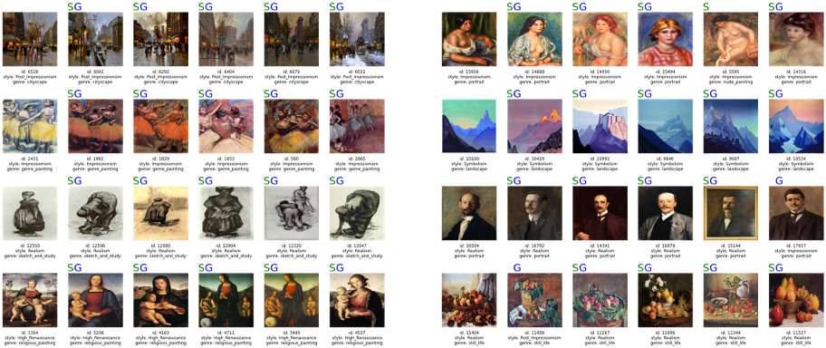
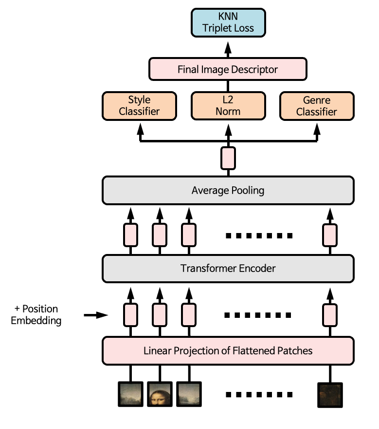
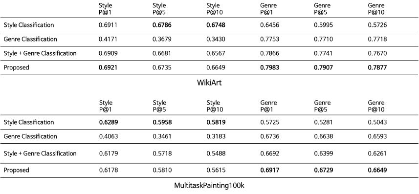

# Fine Art Image Retrieval

This repository is based on the pytorch implementation of [Masked Autoencoders Are Scalable Vision Learners](https://github.com/facebookresearch/mae)(He et al., 2021).

## Architecture

We fine-tuned MAE model at style classification, genre classification and knn triplet learning task simultaneously.

## K-NN Triplet Loss

For each data point $x^{(b)}$ in a minibatch and the nearest neighbors $x_1^{(b)}, x_2^{(b)}, \cdots, x_K^{(b)}$, we define the pairwise relevance measure $r_i^{(b)}$ as:

and the knn triplet loss as:

## Experiments

- [WikiArt](https://github.com/cs-chan/ArtGAN/blob/master/WikiArt%20Dataset/README.md)
  - Notice) We used only images that had both style and genre labels.
- [MulititasPainting100k](http://www.ivl.disco.unimib.it/activities/paintings/)

